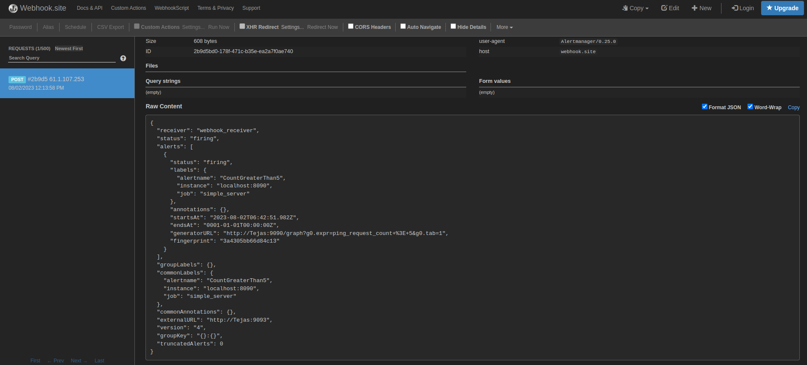

# prometheus-http
- Built my first metric exporter using Go and Prometheus.
- Created a simple HTTP server that exposes metrics to count the number of requests made to the `/ping` endpoint.
- The server runs on port 8090 and the metrics can be viewed at `localhost:8090/metrics`.
- The metrics can be filtered and viewed in Prometheus at `localhost:9090/`.
- I created a dashboard using Grafana for `ping request count`
- Added an alert manager to raise an alert when the ping exceeds beyond 5 and configured a webhook receiver for that.

## Pre-requisites
1. [Go](https://golang.org/doc/install)
2. [Prometheus](https://prometheus.io/docs/prometheus/latest/getting_started/) 
3. [Alert Manager](https://github.com/prometheus/alertmanager/releases)

## Usage
1. Clone this repository, using the following command:
    ```bash
    git clone https://github.com/0xt3j4s/prometheus-http.git
    cd prometheus-http
    ```

2. Build the server
    ```bash
    go build server.go
    ```

3. Run the server
    ```bash
    ./server
    ```

4. To check if the server is running, open the following URL in your browser: http://localhost:8090/ping and then poggers.
5. To view the metrics, open the following URL in your browser: http://localhost:8090/metrics.

6. Run prometheus using the following command:
    ```bash
    prometheus --config.file=prometheus.yml
    ```
7. Visit http://localhost:9090/ and then plot a graph using the expression `ping_request_count` over the last 1 minute (or any other duration).


8. Run the Alert Manager using the following command:
    ```bash
    alertmanager --config.file=alertmanager.yml
    ``` 
9. Visit `localhost:9093/` [Alert Manager] and click on the `Alerts` tab to view the alert.

## Outputs
1. The following output is displayed when the server is running:
    - In the terminal:
    ```bash
    Server is listening on port 8090...
    ```
    - In the browser:
      
    

2. The following output is displayed when the metrics are viewed:
    - In the browser: 

    
3. The following graph can be viewed in Prometheus:
    - Visit `localhost:9090/` and plot a graph after entering the expression `ping_request_count` over the last 1 minute (or any other duration): 

    
4. The following dashboard can be viewed in Grafana:
    - Visit `localhost:3000/` and login with the credentials `admin:admin` and then import the dashboard `ping_request_count.json` from the `dashboards` folder:

    
5. The following alert with status `FIRING` can be viewed in the webhook receiver.
    

6. The alert can be also be viewed in the Alert Manager:
    - Alert confirmed in Prometheus:
    

    - Visit `localhost:9093/` [Alert Manager] and click on the `Alerts` tab to view the alert:

    

_If you found it useful to get started with **Prometheus**, please consider giving it a star (⭐)._
 
## Contributing
Contributions are welcome! If you find any issues or have suggestions for improvement, please create an issue or submit a pull request.

1. Create a Fork
2. Clone your fork
3. Create a new branch
4. Make your changes
5. Commit and push
6. Create a pull request

## License
This project is licensed under the MIT License. See the [LICENSE](LICENSE) file for details.
